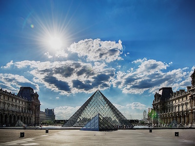
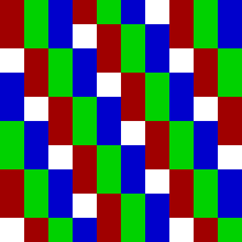
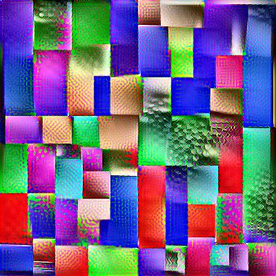
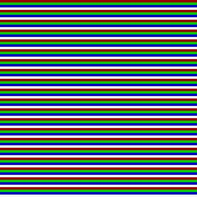
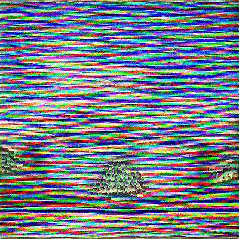
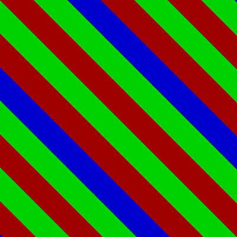
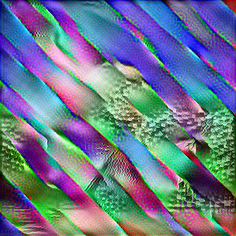

# Neural Style Transfer Samples

----

Sample outputs from the ml-style-transfer source project at https://github.com/timtiemens/ml-style-transfer

Because some of the combinations are fascinating,
but should not be put in the original project source directory.

----

Table of contents

 * [NewAndInteresting](#newandinteresting)

## New And Interesting

### Picaso and Grids [Full output directory](samples/2023-03-13-picaso/)

### Horizontal [Full output directory](samples/2023-03-11-horizontal/)

### Diagonal [Full output directory](samples/2023-03-18-diagonal)

## Historical Samples

